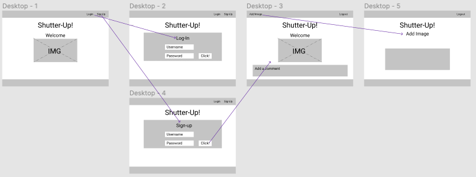
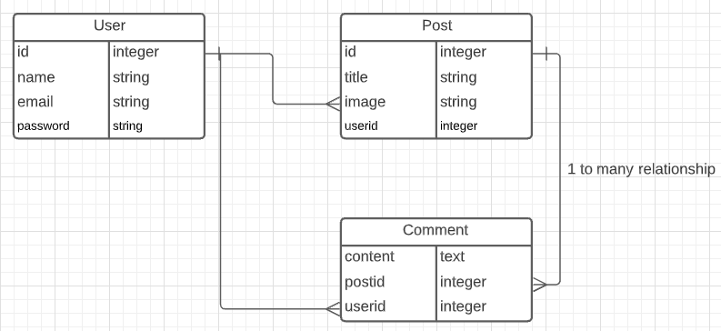

# Shutter-up!
Where photographers share their images.

## Motivation
What motivated me to make this app was that there are a lot of platforms for people to share pictures that they take, but very few where photographers, from all expertise levels, can share their images. Additionally, this will allow photographers to share feedback or give advice on how to better the image.

## Screenshots
screen captures of your app

## User Stories & Wireframes
The planning materials used to build this app.

Image 1

Image 2

## Technologies & Code Snippets
list of technologies
screen captures of your code

## Credits
Give credit to any codepen that inspired you, medium article that helped you, or stackoverflow that pointed you in the right direction.

## Future development
What are the next steps for the project? How will you continue to evolve it?